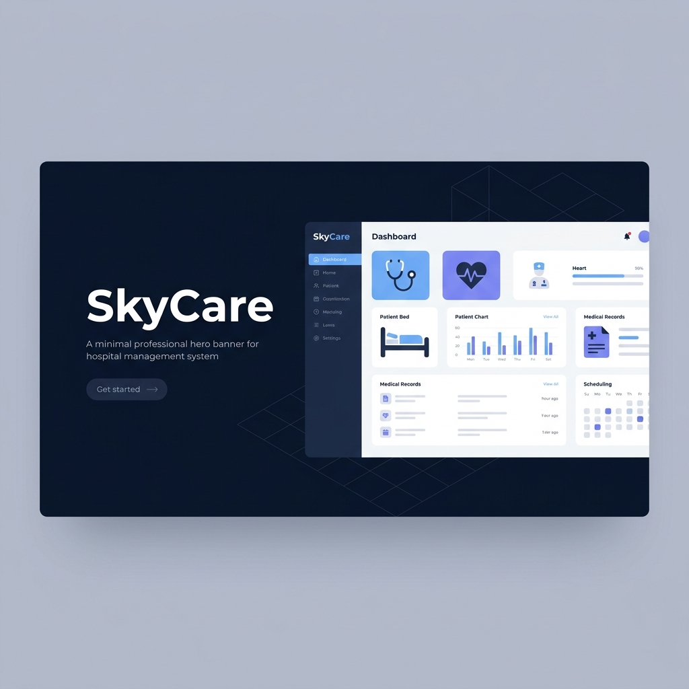

# SkyCare — Hospital Management System



> Modern, secure Hospital Management System with role-based access control, built with Node.js, Express, TiDB (MySQL), Cloudinary, and vanilla JavaScript.

[](https://render.com/deploy)

---

## ✨ Features

### Core Modules
- **Dashboard** — Real-time overview with stats cards, recent admissions, today's appointments, and blood bank summary
- **Departments** — Full CRUD for hospital departments with head doctor assignment
- **Doctors** — Management with specialization, schedule viewing, and department mapping
- **Patients** — Registration with blood group, emergency contacts, and medical history tracking
- **Rooms** — Visual room cards showing occupancy, type (General/Private/ICU/Emergency), and rates
- **Admissions** — Admit/discharge workflow with diagnosis tracking
- **Medical Records** — Complete patient record management with prescriptions and notes
- **Appointments** — Booking system with status tracking (Scheduled/Completed/Cancelled/No Show)
- **Billing** — Invoice management with payment tracking and methods
- **Staff & Duties** — HR module with duty roster scheduling
- **Blood Bank** — Donation tracking with blood group summary and status management

### Security & Administration
- **5-Role RBAC** — Admin, Senior Doctor, Junior Doctor, Nurse, Staff
- **Session-Based Auth** — Secure bcrypt password hashing with token-based sessions
- **Admin-Only User Management** — Create accounts, assign roles, set permissions
- **Audit Log** — Automatic activity tracking for all sensitive operations
- **Profile Picture Upload** — Avatar upload with drag-and-drop support

### Design & UX
- **Modern UI** — SVG icon system, Plus Jakarta Sans typography, clean card-based layout
- **Dark Mode** — Toggle between light and dark themes (persisted via localStorage)
- **Fully Responsive** — Icon-rail sidebar on desktop, hamburger overlay on mobile
- **Custom Components** — Styled toasts, confirm dialogs, file upload zones, search boxes

---

## 🚀 Quick Start

### Prerequisites
- **Node.js** v16 or higher
- **npm** v7 or higher

### Installation

```bash
# Clone the repository
git clone https://github.com/YOUR_USERNAME/SkyCare.git
cd SkyCare

# Install dependencies
npm install

# Start development server
npm run dev
```

Open **http://localhost:3000** in your browser.

### Demo Accounts

| Username | Password | Role |
|----------|----------|------|
| `admin` | `SkyAdmin#2026` | Admin |
| `dr.ayesha` | `DrAyesha#2026` | Senior Doctor |
| `dr.rafi` | `DrRafi#2026` | Junior Doctor |
| `nurse.anwar` | `NurseAnwar#2026` | Nurse |
| `staff.belal` | `StaffBelal#2026` | Staff |

You can override these bootstrap passwords using environment variables:

- `SKYCARE_ADMIN_PASSWORD`
- `SKYCARE_DR_AYESHA_PASSWORD`
- `SKYCARE_DR_RAFI_PASSWORD`
- `SKYCARE_NURSE_ANWAR_PASSWORD`
- `SKYCARE_STAFF_BELAL_PASSWORD`

---

## 🏗️ Tech Stack

| Layer | Technology |
|-------|-----------|
| **Backend** | Node.js + Express.js |
| **Database** | TiDB Serverless (MySQL protocol) via mysql2 |
| **Auth** | bcryptjs (hashing) + Session tokens |
| **Frontend** | Vanilla HTML5, CSS3, JavaScript (ES6+) |
| **Icons** | Custom SVG icon system (35+ icons) |
| **Typography** | Plus Jakarta Sans (Google Fonts) |
| **File Upload** | Multer + Cloudinary |

---

## 📁 Project Structure

```
SkyCare/
├── server.js              # Express server, API routes, auth middleware
├── package.json           # Dependencies and scripts
├── render.yaml            # Render deployment config
├── database/
│   └── init.js            # Schema, indexes, seed data
├── public/
│   ├── index.html         # Main SPA shell
│   ├── login.html         # Login page
│   ├── favicon.svg        # SVG favicon
│   ├── css/
│   │   └── style.css      # Full design system (light/dark themes)
│   ├── js/
│   │   ├── app.js         # Router, theme, sidebar, initialization
│   │   ├── auth.js        # Auth client, session management
│   │   ├── icons.js       # SVG icon library
│   │   ├── utils.js       # API client, toasts, modals, table builder
│   │   ├── pages1.js      # Dashboard, Departments, Doctors, Patients, Rooms
│   │   └── pages2.js      # Admissions, Records, Appointments, Billing, Staff, Blood Bank, Users, Audit
│   ├── img/
│   │   ├── logo.svg       # Custom SVG logo
│   │   └── banner.png     # README banner image
│   └── uploads/           # Optional local folder (legacy; avatars now stored in Cloudinary)
└── .gitignore
```

---

## 🌐 Deployment

### Render (Recommended)

1. Push your code to GitHub
2. Go to [render.com](https://render.com) → **New** → **Web Service**
3. Connect your GitHub repo
4. Render will auto-detect the `render.yaml` Blueprint configuration
5. Click **Deploy**

### Render Compatibility Notes

- Set TiDB env vars in Render: `TIDB_HOST`, `TIDB_PORT`, `TIDB_USER`, `TIDB_PASSWORD`, `TIDB_DATABASE`
- Set Cloudinary env vars in Render: `CLOUDINARY_CLOUD_NAME`, `CLOUDINARY_API_KEY`, `CLOUDINARY_API_SECRET`
- Optional Cloudinary folder override: `CLOUDINARY_FOLDER` (default: `skycare/avatars`)
- Health endpoint for Render and keepalive: `/healthz`
- Self-ping runs every 14 minutes (controlled by env `SELF_PING_ENABLED=true`)

### Important Note About Free Sleep

Render free web services may still sleep without external traffic. The internal self-ping helps keep the app active while running, but for guaranteed no-sleep behavior use an external uptime monitor (for example UptimeRobot) to ping `https://YOUR_RENDER_URL/healthz` every 14 minutes.

### Manual Deployment

```bash
npm install
NODE_ENV=production node server.js
```

The app runs on `PORT` environment variable (default: 3000).

---

## 📝 License

MIT License — free to use for academic and personal projects.

---

## 🙏 Credits

Built as a DBMS Lab Course Project.

**Technologies**: Node.js, Express, TiDB, Cloudinary, Vanilla JavaScript  
**Design**: Inspired by modern medical SaaS platforms (Behance references)
